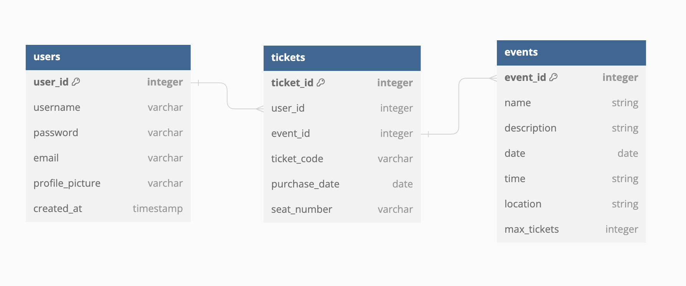

# T3CK

T3CK is the ultimate ticket marketplace revolutionizing the way to buy and sell event tickets! It leverages the power of blockchain and NFT technology to offer a secure, transparent, and seamless ticketing experience.

### DB Design

## Tech Stack & Tools

-   TypeScript
-   Material UI
-   GraphQL
-   Prisma
-   Express (Backend Framework)
-   [React](https://reactjs.org/) (Frontend Framework)
-   [Hardhat](https://hardhat.org/) (Development Framework)
-   [Ethers.js](https://docs.ethers.io/v5/) (Blockchain Interaction)
-   [MetaMask](https://metamask.io/)
-   Solidity (Smart Contracts & Tests)
-   Javascript (Testing)

## Requirements For Initial Setup

-   Install [NodeJS](https://nodejs.org/en/). Recommended to use the LTS version.
-   Install [MetaMask](https://metamask.io/) on your browser.

## Setting Up

### 1. Clone the Repository

### 2. Install Dependencies for server and client folder:

`$ cd client`
`$ npm install`

`$ cd server`
`$ npm install`

### 3. Run tests for hardhat

`$ cd server`
`$ npx hardhat test`

### 4. Start Hardhat node

`$ cd server`
`$ cd blockchain`
`$ npx hardhat node`

### 5. Run deployment script

In a separate terminal execute:
`$ cd server`
`$ cd blockchain`
`$ npx hardhat run ./scripts/deploy.js --network localhost`

### 6. Start frontend

`$ cd client`
`$ npm run start`

### 7. Start backend

`$ cd server`
`$ npm run start`

--

##### Credits: Dapp University - Solidity code
